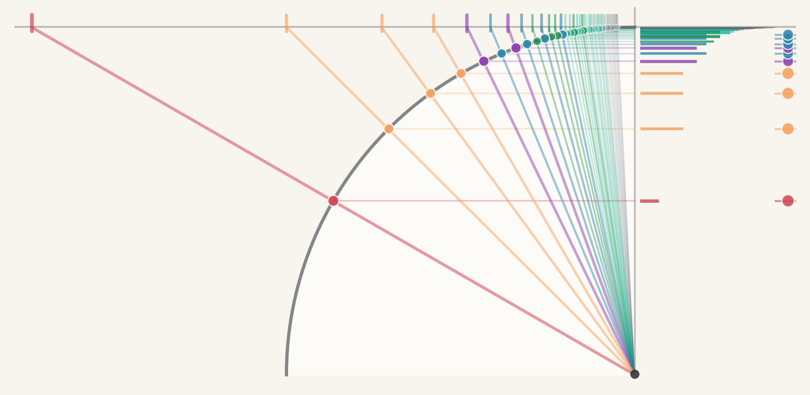

# wedoincircles

The program tests whether a candidate functor `F` relates the native closure structures of two arithmetic objects: the log-side affine apparatus `Aff⁺(ℝ)` (motivated by the floating-point residue `ε(m) = log₂(1+m) − m` from *Landfall*) and the circle-side cyclotomic apparatus `{K_n = ℚ(cos(2π/n))}` (motivated by the regular `n`-gon wholeness construction). The working expectation is that no such `F` exists, and that the shape of the no is the content worth recording.

## Shape

The shape of the no is a closure-depth mismatch. On the log side, the native closure object `Aff⁺(ℝ)` — affine composition of the machine's primitive operations — is flat: iterating composition never leaves the two-parameter affine form. On the circle side, the trace-field ladder `K_n = ℚ(cos(2π/n))` has `[K_n : ℚ] = φ(n)/2`, which is unbounded as `n` varies. No native functor preserving closure-generator depth can carry a flat object to an unbounded ladder. The no-go holds over any field admitting Chebyshev polynomials and affine maps.

## State

Current state, per branch:

- **Closure-depth no-go.** Proven under named functorial axioms. Self-contained algebra; names no transcendental constants.
- **Strip-H¹ / circumscribed-Hurwitz identification.** Proven: the strip-tissue `H¹` seminorm equals the circumscribed regular `n`-gon's Hurwitz gap up to `R_n = 16π⁶/(45n⁴) + 128π⁸/(315n⁶) + O(n⁻⁸)`. The radial-graph lift *is* the circumscribed polygon.
- **Naive Liouville endgame for transcendence of `π`.** Closed negative. All circle-side Archimedean observables factor through a single approximant `α_n = n tan(π/n)`, whose cyclotomic height is exponential in `φ(n) log n`. The Liouville lower bound fails to meet the `1/n²` Archimedean upper bound for every `n ≥ 3`.
- **Kraft–Parseval discrepancy route for effective transcendence of `π`.** Open search. The empirical-to-density bridge is the one remaining hypothesis.
- **Compute-cost lower bound on counting primitives.** Open search; ledger pivot has surfaced a best-current-candidate triple under stated working assumptions: T1/T3 + `V_cert` (per-cell value certificates) + algebraic-arithmetic over ℚ *in its certification-preserving form (paid adjunctions, bounded constants, no free unbounded linear combinations)*, with `|M_N|` dropped as ledger. The certification-preserving qualifier is load-bearing — under unbounded-linear readings of the model the A-axis collapses (FFT-style mult-to-add conversion) and the matching demotes. The Landfall-parallel theorem still requires promoting the driving impossibility from working form to a proven impossibility, and a cost theorem connecting `V_cert` components to primitive-op count. See [memos/LEDGER-PIVOT-SEARCH.md](memos/LEDGER-PIVOT-SEARCH.md) for the lattice apparatus and [memos/FFT-COMPLEXITY-FOUR-FRAMEWORK-SYNTHESIS.md](memos/FFT-COMPLEXITY-FOUR-FRAMEWORK-SYNTHESIS.md) for the load-bearing summary of where the bridge sits relative to the FFT-complexity literature: four frameworks at four axiom-coordinates, with the program's certification-preserving regime as a fifth coordinate that no existing framework occupies — making the bridge work *construction*, not *import*.

The closure-depth theorem does not depend on any of the other branches; the strip-H¹ identification does not use Liouville; the negative closure of the Liouville endgame is a disciplined output in its own right, recording plainly that the circle side's Archimedean observables factor through an approximant whose height rules out the contradiction the endgame wanted. 

The final lower-bound theorem, when it closes, will have a triadic structure: three independent struts speaking different cost-currencies. Each alone gives a partial bound; any two give a stronger one; all three give the full theorem with redundancy under failure of any single strut. The three are the closure-depth no-go (the *structural* fault line, already in hand), the compute-cost lower bound on counting primitives (the *per-instance algebraic-content* fault line, open search), and the Kraft–Parseval discrepancy bound (the *cross-input encoding* fault line, open search). The analogy is to truss bridges, where triangulation combines compression, tension, and shear on different members and the rigidity comes from the three together. Kraft accounting is one strut, not the whole bridge. Other branches of the program may yet prove load-bearing for one or more of the three in ways not yet foreseen.

## Stance

We stand behind the discipline described in [CONTRIBUTING.md](CONTRIBUTING.md). In order to do this our claims must know whether they are load-bearing or exploratory. This means you must know as well.

## Growth

We work under [a set of sharp questions](BNHA/VILLAINS.md) about ourselves; five are answered, one is quarantined as open search, one is refused on the grounds that inversion of the premise is enlightenment.

