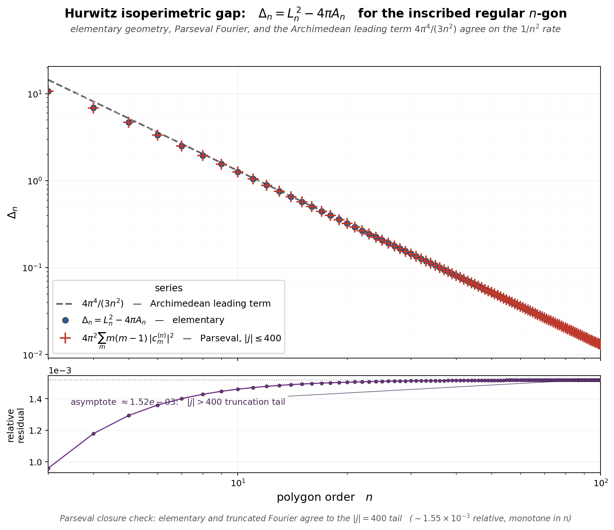

# HURWITZ-GAP

The Hurwitz-gap rate figure at `figures/hurwitz_gap_rate.png` (built by `corners/hurwitz_gap.sage`) plots the isoperimetric gap

    Δ_n  =  L_n² − 4π A_n

of the inscribed regular n-gon over `n ∈ [3, 100]`, computed three ways and compared on log–log. Navy circles are the elementary evaluation `L_n² − 4π A_n` from the closed forms `L_n = 2n sin(π/n)` and `A_n = (n/2) sin(2π/n)`. Red crosses are the Parseval truncation `4π² Σ m(m−1)|c_m^{(n)}|²` with `|j| ≤ 400`. The gray dashed line is the Archimedean leading term `4π⁴/(3n²)`. All three curves collapse onto each other visually from `n = 3` onward; the lower residual panel shows the elementary-vs-Parseval relative difference sitting on a `~1.55 × 10⁻³` floor that is the `|j| > 400` truncation tail, not a model mismatch.

The Fourier setup is the Hurwitz 1902 identity. For any simple closed curve `γ : [0, L] → ℂ` parametrized by arc length, writing `γ(s) = Σ c_m e^{2πi m s / L}` gives

    L² − 4π A  =  4π² Σ_{m ∈ ℤ}  m(m−1) |c_m|²,

with equality (the circle) iff `c_m = 0` for every `m ∉ {0, 1}`. For the inscribed regular n-gon a geometric-sum computation from `γ'(s) = T_k = ω^k i e^{iπ/n}` on edge k gives a sparse coefficient lattice:

    c_m  =  0                     unless  m ≡ 1 (mod n),
    c_m  =  L_n² / (4π² m²)       for  m = 1 + j·n,  j ∈ ℤ.

The closed form `Δ_n = L_n² · [1 − (π/n) cot(π/n)]` exposes the Archimedean asymptote `Δ_n = 4π⁴/(3n²) + O(1/n⁴)` by Taylor-expanding `cot` at the origin. The Parseval sum hits this rate from the lowest-admissible off-{0,1} mode at `m = 1 + n`.

This is the Dido hinge. The Fourier-side Hurwitz identity reads `π` into the extremum condition of a Parseval quadratic form — the circle maximizes the enclosed area per unit perimeter precisely by being the curve whose Fourier support is `{0, 1}`. The isoperimetric gap `Δ_n` measures, in Fourier-Parseval norm, how far the regular n-gon sits from that extremum. For the program at `memos/KRAFT-HERMITE-LINDEMANN-AITCHISON.md`, the figure closes steps 1–2: the identity is not assumed, it is enacted numerically — elementary agrees with Parseval, both hit the Archimedean leading term, the coefficients are explicit.

Three things the figure makes visible without further prose: (i) the `4π⁴/(3n²)` Archimedean rate is hit cleanly from `n = 3` upward — the convergence to the circle is *polynomial*, not exponential, which is the quantitative complexion that makes the approach-to-π a Kraft-budget question rather than a ruler-and-compass question; (ii) the elementary and Parseval computations agree to the `|j| = 400` truncation floor (`~1.55 × 10⁻³` relative), which is a numerical stand-in for the Hurwitz identity itself — the figure is a Parseval closure check, not a curve fit; (iii) the `1/n²` rate is the *same* Archimedean rate visible in `figures/tau_portrait.png` (the `−4π²/n²` large-n asymptote of τ), and at `figures/counting_near_half_gaps.png` (the `π²/(4n²)` floor on the exact-cos-aligned subsequence) — three different circle-side observables agreeing on `1/n²` is the signature that they all read a common Archimedean leading term. For the theorem-level first-band statement and its dyadic-shell corollary behind the frequency plot, see [corners/HURWITZ-FIRST-BAND-CONCENTRATION.md](corners/HURWITZ-FIRST-BAND-CONCENTRATION.md). For the coefficient-side and frequency-band companions, see `figures/hurwitz_gap_coefficients.png` and `figures/hurwitz_gap_frequency_decomposition.png`; for program context, see `memos/KRAFT-HERMITE-LINDEMANN-AITCHISON.md` §"Proposed order of work" and [corners/TAU-PORTRAIT.md](corners/TAU-PORTRAIT.md).
