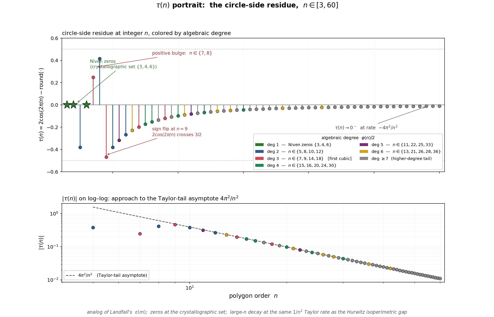
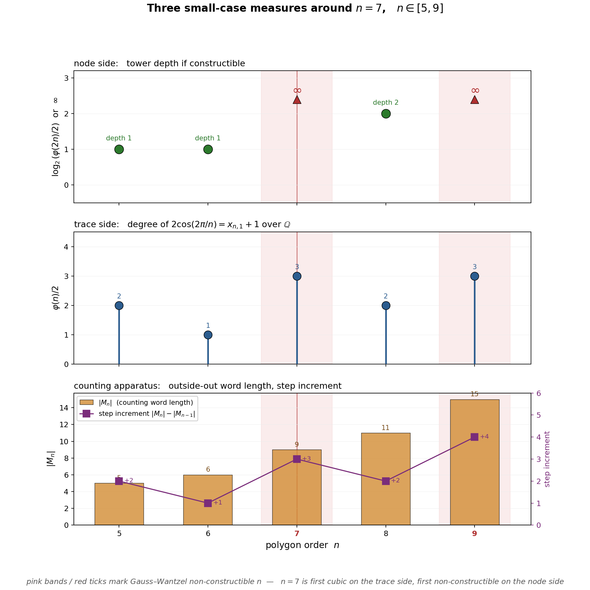

# COUNTING-APPARATUS

Working notes for the program's most uncertain ambition: binding the counting apparatus at `n-gons/counting/` to the circle-side equivariant surrogate, so that the counting word `M_N` becomes a compute-cost ledger and the whole thing can be stated as a computational-impossibility lower bound paralleling Landfall's log-side result.

This is a **search doc**, not a result doc. It lays out four prerequisites — (A) compute model, (B) task that makes counting the natural ledger, (C) portrait of τ strong enough to carry belief, (D) small-case walkthrough — tracks what's known and unknown for each, and notes which existing repo materials feed in. Progress gets appended here until the pieces are sharp enough to state a conjecture; at that point the result-shaped material promotes to `BNHA/triad/Creati/INSCRIPTION-PAPER-PLAN.md` (Inscription §§1/4 hardening) and possibly its own companion doc.

---

## The target

Landfall's shape, as a template:

- An **equivariant surrogate**: Mitchell's L(x) = E + m, the free-representation estimator of log₂. "The representation is the log table, up to bias."
- A **residue** that survives finite closure: ε(m) = log₂(1+m) − m, continuous but not C¹, Fourier-nontrivial, transcendental at algebraic m.
- A **compute-cost lower bound**: any process beating L to precision ε must perform ≥ f(ε) primitive operations in a fixed compute model. Six walls (§§1–6 of Landfall) each force cost.

Circle-side analog, desired shape:

- **Equivariant surrogate**: `round(2cos(2π/n))`, free in the lattice representation (integer arithmetic on R_n), exact on the crystallographic set {1, 2, 3, 4, 6}.
- **Residue**: τ(n) = 2cos(2π/n) − round(2cos(2π/n)), algebraic of degree φ(n)/2 over ℚ, zeros exactly on the crystallographic set, values in [−1/2, 1/2].
- **Compute-cost lower bound**: any process beating round-trace at n-gon corner resolution N must perform ≥ g(N) primitive operations, where g(N) matches the counting apparatus's `M_N` growth.

Three a-priori facts that make the circle-side ambition plausible, playing the role Gelfond–Schneider / smoothness-break / Padé-closure-failure play on the log side:

1. **Lindemann** (transcendence of π): the classical compute model (ruler-and-compass) literally cannot reach π. Base case.
2. **Unbounded cyclotomic depth**: the algebraic degree of 2cos(2π/n) is φ(n)/2, growing without bound as n sweeps ℤ; no finite cyclotomic extension of ℚ contains all of τ. Closure-failure analog.
3. **Gauss–Wantzel failure at n = 7**: the first non-constructible node in the pseudo-Chebyshev sequence; the first cubic; the first break from ℤ[x]-closure via Chebyshev. Quantitative classical limit.

The facts exist. The work is to assemble them into a belief-forming portrait and wire that portrait to a compute-cost statement.

---

## (A) A compute model

**What it is.** A choice of primitive operations against which "cost" is counted. On the log side, Landfall uses floating-point IEEE operations; the free step is the representation-as-log-table.

**Candidates for the circle side**, in roughly decreasing classical fidelity:

1. **Ruler-and-compass.** Closes outright for non-Fermat-prime n (first at n = 7). Extends to π at the Lindemann limit. Useful as the limiting case — too classical to give quantitative bounds inside the reachable regime.
2. **Ruler-and-compass + integer arithmetic.** Adds a free integer-op budget. Quantitative within the Gauss–Wantzel reachable set, but still closed outside it.
3. **Algebraic-arithmetic over ℚ.** Primitive ops: add, subtract, multiply, divide, adjoin an algebraic number of degree ≤ d. Operations at degree-d cost poly(d). In this model, computing τ(n) to precision ε requires a field extension of degree φ(n)/2, so total cost is poly(φ(n)/2) · log(1/ε). Generalizes ruler-and-compass naturally (which is exactly degree-2ᵏ) and makes Lindemann the E = ∞ boundary.
4. **Algebraic straight-line programs** (ASLP). A cleaner abstract version of (3) measuring depth of field extension plus length of arithmetic circuit. Probably the right formal framework if (3) turns out to be ambiguous.
5. **Gosper-style Möbius transducer.** The log side has Gosper's 8-variable CF machine as an exact-arithmetic compute model. The circle-side analog would be a finite-state transducer on rotation data. Not obviously right; flagged for completeness.

**Decision gate.** Commit before (B) and (D). Current lean: (3) or (4).

**Open:** whether the chosen model is expressive enough to state the bind without circularity, and restrictive enough that the lower bound isn't vacuous. The compute-model choice is explicitly coupled to the ledger choice. **Update:** `memos/LEDGER-PIVOT-SEARCH.md` §"Task-ledger admissibility" has surfaced a best-current-candidate triple under the original Landfall-parallel ambition: model (3) algebraic-arithmetic over ℚ (or model (4) ASLP), with `V_cert` as the cost ledger, viable for tasks T1 and T3 below. The original "lean (3) or (4)" is now narrowed to that triple, *under the working form of the driving impossibility plus a still-needed cost theorem connecting V_cert components to primitive-op count*. Path 1 (crystallographic rank/lattice with ψ-ledger) and the combinatorial F2 alternative remain available as different-theorem branches but require different compute models; see `LEDGER-PIVOT-SEARCH §"Compute-model / ledger coupling"` and §"Task-ledger admissibility".

---

## (B) A task that makes counting the natural ledger

**What it is.** A precise computational task whose primitive-operation cost in the chosen compute model is lower-bounded by `|M_N|` (or some explicit function of M_N). This is the bind itself — the load-bearing piece, and the reason the whole ambition might be vain.

The outside-out counting word `M_N` is already an output of a specific computation — the outside-out corner sweep over regular n-gons n ∈ [3, N] circumscribed around the unit circle, projected to strip coordinates. Each cell of `M_N` records a corner-count at a specific X-value on [−1, 1]. The question is whether this output's length and update complexity are a real cost measure for a task that requires beating the round-trace surrogate.

**Candidate task statements:**

- **T1.** Enumerate corner positions of all n-gons n ∈ [3, N] on [−1, 1] at resolution 10⁻ᵏ. Output: an ordered list of (n, k, X(n, k)) triples with X computed to k decimal places.
- **T2.** Compute `M_N` itself. Output: the integer sequence of length |M_N|.
- **T3.** Distinguish pairs (n, k) whose round-trace agrees but whose actual trace differs at precision ε. Output: a distinguishing witness at each such pair.

T2 is simplest but risks being tautological ("|M_N| is the cost of computing M_N"). T1 and T3 are substantive but need a lower-bound argument that ties them to M_N.

**Generate-vs-distinguish framing (Fortnow).** T1 and T2 are *generating* tasks — produce `x` given input, in the sense of Fortnow's time-bounded `C^t`. T3 is a *distinguishing* task — label a candidate `z` as `=x` or not in time `t`, in the sense of `CD^t`. See `memos/FORTNOW-KOLMOGOROV-BRIEF.md` §7. Without a time bound, `C ≤ CD + O(1)` by brute-force search, but in polynomial time Fortnow's Theorem 7.2 says unconditional `C^q ≤ CD^p + c log|x|` is equivalent to a poly-time function emitting the unique satisfying assignment of any formula with exactly one satisfying assignment — "only slightly weaker than `P = NP`." A direct poly-time T3 → T2 reduction would therefore sit near `P = NP` and should be treated as presumptively unavailable.

The consequence for this search: the right direction is to land on T3 directly, with `|M_N|` as the natural ledger, and *not* reduce it to T2. Fortnow's Theorem 8.1 gives a matching upper bound `CD^p(x) ≤ 2 log|A ∩ Σ^n| + c log n` for any `A ∈ P`, which a T3 lower bound has to beat to be non-trivial. See `memos/LOWER-BOUND-COUNTRY.md` §(E) for the Kolmogorov-complexity reading thread that makes this concrete.

**Target claim:** the cost of T1 (or T3) is Θ(|M_N|) in the chosen compute model. The easy direction (|M_N| as an upper bound, via the outside-out sweep) is constructive. The hard direction (|M_N| as a lower bound) is the real research question.

**Open:** given the Fortnow framing above, the earlier question — is there a direct reduction from beating-round-trace (T3) to corner-enumeration (T2)? — is presumptively closed in the polynomial-time direction: a yes-answer would imply a result near `P = NP`. The live question becomes whether T3 can be attacked directly, with `|M_N|` as the natural ledger, without any reduction to T2. If yes, the bind stands on T3's own terms. If no, the bind needs a different T3-shaped task or a different cost measure than `|M_N|`. **(Now resolved — see Update below: the "different cost measure" branch was taken.)**

**Update from `LEDGER-PIVOT-SEARCH §"Task-ledger admissibility"`.** The "different cost measure than `|M_N|`" question is now answered: `V_cert` (per-cell value certificates) is the lattice-matching ledger for both T1 and T3, and `|M_N|` is dropped as a ledger candidate for those tasks. T2 admits no algebraic-content ledger except by reformulation as typed-incidence production, in which case `F2` (the six-field incidence ledger) is the match. The program's branch choice — Landfall-parallel cyclotomic-depth lower bound (T1/T3 + `V_cert`) vs. combinatorial typed-incidence theorem (T2 + `F2`) — is now legible at the compute-cost level.

---

## (C) Portrait of τ

**What it is.** A combined structural description of τ(n) that makes the closure-failure visible the way ε's shape did on the log side. Not a proof; a belief-forming picture.

**Atomic facts already in the repo** (scattered across CREATI §§C1/item-9, PSEUDO-CHEBYSHEV-NODES, INSCRIPTION-PAPER-PLAN):

- **Domain**: n ∈ ℤ_{≥1}. Discrete. No natural continuous parameter at this level. (BIND's continuous-E τ_c(n, k, E) is a continuous-parameter analog on a different axis.)
- **Values**: τ(n) ∈ [−1/2, 1/2]. Bounded.
- **Zeros**: exactly {1, 2, 3, 4, 6} (crystallographic set, by Niven).
- **Algebraic structure**: τ(n) is algebraic of degree φ(n)/2 for n ≥ 5 outside {6}; minimal polynomial inherited from 2cos(2π/n) − integer.
- **Galois**: determined by the prime factorization of n through Galois theory of ℚ(ζ_n).
- **Decay**: τ(n) → 0 as n → ∞ (since 2cos(2π/n) → 2 and round picks up 2 once n is large).
- **Cyclotomic closure**: ⋃_n ℚ(τ(n)) has no finite-degree subfield containing all τ(n); any attempt to fit the sequence in a fixed cyclotomic extension breaks at some finite n.
- **No obvious Fourier content**: τ is defined on ℤ, not on a continuous seam. A Dirichlet-style or lattice-Fourier picture may still be worth working out.

**Artifact (built):** `corners/tau_portrait.py` produces `figures/tau_portrait.png` — two panels, stem plot of τ(n) on linear y over n ∈ [3, 60] colored by algebraic degree **φ(n)/2** (the correct degree for 2cos(2π/n); an earlier revision of this bullet said φ(2n)/2, which is the degree of cos(π/n) — a different object at `corners/PSEUDO-CHEBYSHEV-NODES.md`), Niven zeros at {1, 2, 3, 4, 6} marked with green stars, and a log-log companion of |τ(n)| against the 4π²/n² Taylor-tail asymptote.

**What the portrait makes visible:**

- **Niven zeros** at n ∈ {3, 4, 6} (and degenerate {1, 2}): green stars at y = 0. The only rational values τ takes on ℤ.
- **First cubic at n = 7** (orange-red stem, τ(7) ≈ +0.247), coinciding with the first Gauss–Wantzel non-constructible n. The algebraic-depth discontinuity and the rounding-direction bulge meet at the same n.
- **Positive bulge** at n ∈ {7, 8}: the only non-Niven n at which τ > 0. `2cos(2π/n)` crosses 3/2 between n = 8 (value 1.414) and n = 9 (value 1.532), so rounding direction flips; τ(n) < 0 for all non-Niven n ≥ 9.
- **1/n² decay**: the log-log panel shows |τ(n)| approaching `4π²/n²` from below; convergence is visible by n ≈ 15. Same Taylor-tail rate as the Hurwitz isoperimetric gap at `corners/hurwitz_gap.sage` — not coincidence: both come from the Taylor expansion of cos at 0.

**What's still missing for the portrait:**

- A single prose statement that collects the above into "here is why no finite algebraic structure reaches τ." (The portrait supplies the belief-forming visual; the paragraph is a follow-on write-up that reads it.)
- A rigorous decay-rate statement with explicit error term (τ(n) = −4π²/n² + O(1/n⁴) for n ≥ 9, as elementary Taylor gives). Visible in the log-log panel; not yet written as a lemma.
- A denominator-rank / counting relation on the same ℤ-domain (compatible with the vocabulary-hygiene rule at `AGENTS.md §"Shared-vocabulary hygiene"`).
- A spectral or analytic observation analogous to ε's O(1/n²) Fourier tail on the log side.

Allied extant reading: `figures/counting_psi_stratification.png` plots ψ(n)-classed x-support of the outside-out sweep, which reads the same algebraic-depth structure through a different observable (sweep x-coordinates rather than τ residues). Complementary to `tau_portrait.png`. See `n-gons/counting/PSI-STRATIFICATION.md` for the figure's companion memo.

**Outcome target:** a paragraph that reads, for τ, the way Landfall's §4 reads for ε — compact, load-bearing, a belief pillar. The portrait unlocks writing that paragraph.

---

## (D) Small-case walkthrough

Pick **n = 7**. First non-constructible node; first cubic on the trace side; first break from the Chebyshev-reachable regime.

**Three cost measures to compute at n = 7:**

1. **Ruler-and-compass cost**: infinite. node(7) = cos(π/7) is not constructible.
2. **Algebraic-arithmetic cost** (compute model (A3) or (A4)): working in the degree-3 extension ℚ(cos(2π/7)) over ℚ. Computing τ(7) to precision ε requires a field extension of degree 3, arithmetic at that degree, and log(1/ε) digits of precision. Cost: O(poly(3) · log(1/ε)).
3. **Counting-apparatus observable**: `M_7` (the counting word truncated at N = 7). Length, update cost from M_6 → M_7, multiplicity at the new n = 7 corner positions. Already computable via `n-gons/counting/outside_out.py`.

**Target:** the three measures make the n = 7 break legible without pretending they are the same invariant. The node-side obstruction and the trace-side degree ladder both break there; the current counting-length ledger does not. That honest separation is the belief-forming observation.

**Artifact (built):** `n-gons/counting/case_seven.py` produces `figures/case_seven_three_costs.png` — three stacked panels, shared x-axis n ∈ [5, 9], with the Gauss–Wantzel non-constructible set `{7, 9}` shaded pink and marked with red bold x-ticks. Panel 1 is node-side (`\varphi(2n)/2`, constructibility); panel 2 is trace-side (`\varphi(n)/2`, the degree of `2cos(2π/n)` and of the outside-out row field); panel 3 is the counting-length ledger.

**The data** (figure range, with n = 10, 11 appended to make the n mod 4 pattern of the counting-ledger step unambiguous):

| n | 2n | φ(2n) | φ(n) | trace degree φ(n)/2 | constructible? | tower depth | \|M_n\| | Δ\|M_n\| |
|---:|---:|---:|---:|---:|:---:|---:|---:|---:|
| 5 | 10 | 4 | 4 | 2 | yes | 1 | 5 | +2 |
| 6 | 12 | 4 | 2 | 1 | yes | 1 | 6 | +1 |
| **7** | **14** | **6** | **6** | **3** | **NO** | **∞** | **9** | **+3** |
| 8 | 16 | 8 | 4 | 2 | yes | 2 | 11 | +2 |
| 9 | 18 | 6 | 6 | 3 | NO | ∞ | 15 | +4 |
| 10 | 20 | 8 | 4 | 2 | yes | 2 | 17 | +2 |
| 11 | 22 | 10 | 10 | 5 | NO | ∞ | 22 | +5 |

Three observations the figure makes precise:

1. **Node-side constructibility and trace degree share the n = 7 discontinuity cleanly, even though they are different invariants.** n = 7 is simultaneously the first n at which `cos(π/n)` is not Gauss–Wantzel constructible, and the first n at which the trace field `ℚ(cos(2π/n))` becomes cubic. `n = 6` is the instructive separation: the node-side half-angle degree stays at `φ(2n)/2 = 2`, while the trace degree drops to `φ(n)/2 = 1`. The comparison is therefore honest: panel 1 measures the half-angle / node side, panel 2 measures the trace side, and they still first break together at `n = 7`.

2. **The counting ledger step does not share this discontinuity.** Step increments Δ\|M_n\| across n = 5…11 are `+2, +1, +3, +2, +4, +2, +5` — a pattern governed by n mod 4 (odd n give larger steps: +2, +3, +4, +5 at n = 5, 7, 9, 11; even n stay small: +1, +2, +2 at n = 6, 8, 10) rather than by algebraic depth. The +3 at n = 7 fits the odd-n trend; it is *not* anomalous against its neighbors. This is an honest negative finding: the counting-apparatus *length* observable does not localize the Gauss–Wantzel failure directly, and the "three cost measures tracking each other" framing in the original version of this section was too strong.

3. **Implication for the search.** If the compute-cost bind the program is after requires the ledger to witness algebraic-depth discontinuities at specific n, then the ledger in its current form (length or step increment of the outside-out word) is the wrong observable. A different corner-side observable — perhaps the *value* structure of the M_N entries (Euler-phi content via the terminal singleton `2(N−2)` and the interior singletons) rather than their *length* — may be where the algebraic-depth signature lives. Allied extant reading: `figures/counting_psi_stratification.png` shows the ψ(n)-stratified sweep-x-support through n = 40, which *does* localize the algebraic-depth discontinuity at n = 7 through the ψ classes. That figure is a stronger candidate for belief-forming than the length-based ledger shown here. See `n-gons/counting/PSI-STRATIFICATION.md` for the figure's companion memo.

---

## Adjacent anchors

Existing material this work draws on:

- `memos/LANDFALL-EXPORT.md` — log-side template.
- `corners/PSEUDO-CHEBYSHEV-NODES.md` — algebraic-degree catalog, Gauss–Wantzel constructibility, the n = 7 first-break.
- `BNHA/triad/Creati/CREATI-THE-CIRCLE.md` §§C1, item 9 — τ definition and algebraic-degree.
- `n-gons/counting/COUNTING.md` and the `n-gons/counting/` directory generally — the counting apparatus itself (output `M_N`, update maps, raster figures, Champernowne encoding).
- `BNHA/triad/Creati/INSCRIPTION-PAPER-PLAN.md` §§1/4 — the "softened" walls this work wants to harden.
- `BNHA/SirNighteye/DONT-BELIEVE-ME-JUST-WATCH.md` — the verdict outline, stated in advance in compact-Fourier vocabulary. Its seven rubrics (D1–D4 disanalogies, C5–C7 structural contrasts, plus the coordinative consequence Δ^L = −ε) are each a place this search's quantitative witness has to land. Direct impact here: C6 names item (A)'s compute-model candidate in FFT vocabulary (Cooley–Tukey radix-2 butterfly, native on the unit circle, non-recurring on the log-binade); D1 locates where the Lindemann-dependence of the mismatch enters, feeding the circularity map in `memos/LINDEMANN-BRIEF.md`; and the coordinative-consequence closer reframes "beating the surrogate" as closing an additive-vs-logarithmic (or angular-vs-Euclidean) displacement field — which is the shape the portrait-of-τ in item (C) has been trying to articulate.
- `BNHA/triad/Eraserhead/BIND-THE-CIRCLE.md` — τ_c continuous-E tool; the continuous-parameter analog of τ.
- `memos/CRYSTALLOGRAPHIC-RESTRICTION-BRIEF.md` — the Bamberg–Cairns–Kilminster ψ-function and the higher-dimensional lattice extension.
- `memos/CONTINUED-FRACTIONS-CROSSWALK.md` — the CF axis that cuts across disciplines.
- `memos/LINDEMANN-BRIEF.md` — classical transcendence of π, plus a circularity map for when invoking Lindemann–Weierstrass in the compute-cost argument is safe, programmatically weak, or strictly circular. The base case.

**Anchors yet to be written:**

- Possibly `memos/GAUSS-WANTZEL-BRIEF.md` — ruler-and-compass impossibility for regular 2n-gons at non-Fermat-prime n; the quantitative classical limit. (Alternatively: extend `corners/PSEUDO-CHEBYSHEV-NODES.md` §Constructibility into a richer source-facing anchor.)

---

## What this doc is not

- **Not a proof.** Nothing here is theorem-shaped yet.
- **Not a paper plan.** The paper plan (Inscription) lives at `BNHA/triad/Creati/INSCRIPTION-PAPER-PLAN.md`. This doc is upstream: it supplies the compute-cost content that the paper plan currently disclaims in §"What the paper is for."
- **Not a commitment to achievability.** The ambition may be vain. This doc is for tracking the search while that's still uncertain. Partial success is informative; full failure would be informative too.

---

## Proposed order of work

Ranked from least load-bearing / fastest to complete toward the real research bottleneck:

1. Draft `memos/LINDEMANN-BRIEF.md` (classical anchor).
2. Write (C) — the portrait of τ. A single section; adds directly to this doc or gets its own file once it grows.
3. Decide (A) — the compute model. Short committed statement with a paragraph of rationale.
4. Run (D) — the n = 7 walkthrough. Script + short narrative appended here.
5. Attempt (B) — the task statement. Will likely iterate; interacts with (A) once tried.

Promotion out of this doc: when (C) and (D) together carry belief, and (A) and (B) are sharp enough to state a conjecture, the combined result promotes to an Inscription-§§1/4-hardening section, and `BNHA/triad/Creati/INSCRIPTION-PAPER-PLAN.md` §"What the paper is for" gets its impossibility-disclaim rewritten as an aim.
