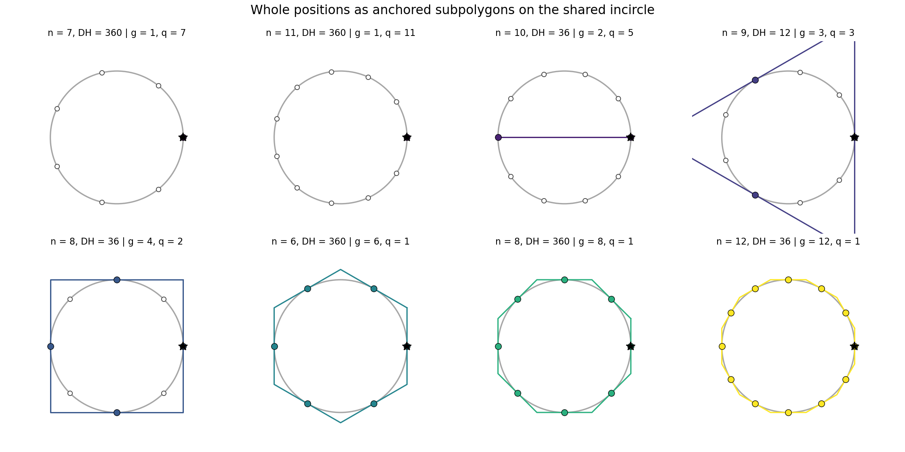
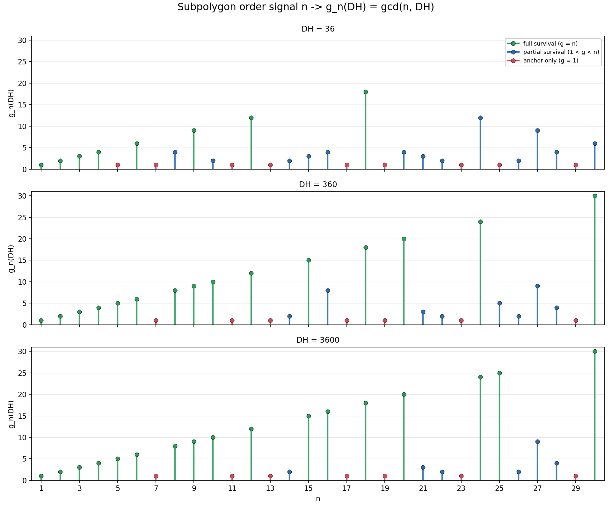

# SUBPOLYGON

For fixed designated wholeness `DH` and polygon order `n`, the binary test

$$
b_n(DH)=\mathbf 1[n \mid DH]
$$

only asks whether **every** position of the `n`-gon is whole. The finer object is the whole-position set itself.

## Setup

Let

$$
W_n(DH)=\{\,k \in \{0,\dots,n-1\}: k\,DH/n \in \mathbb Z\,\}.
$$

Set

$$
g_n(DH)=\gcd(n,DH), \qquad q_n(DH)=\frac{n}{g_n(DH)}.
$$

Here `g_n(DH)` is the order of the surviving whole subpolygon, and `q_n(DH)` is the step size between successive whole positions in the `n`-gon's position numbering.

## Theorem

For integers `n >= 1` and `DH >= 1`,

$$
W_n(DH)=\{\,j\,q_n(DH): j=0,\dots,g_n(DH)-1\,\} \pmod n.
$$

Equivalently, `W_n(DH)` is the unique subgroup of `\mathbb Z/n` of order `g_n(DH)`, generated by `q_n(DH)=n/g_n(DH)`.

## Proof

View the position labels modulo `n`, and consider the endomorphism

$$
\mu_{DH} : \mathbb Z/n \to \mathbb Z/n, \qquad [k] \mapsto [DH \cdot k].
$$

Then `W_n(DH)` is exactly the kernel of `\mu_{DH}`, since `[k]` is in the kernel iff `n | DH \cdot k`, which is the same as `k\,DH/n \in \mathbb Z`.

Write

$$
g=\gcd(n,DH), \qquad n=g a, \qquad DH=g b, \qquad \gcd(a,b)=1.
$$

Then

$$
n \mid DH \cdot k
\iff ga \mid g b k
\iff a \mid b k
\iff a \mid k,
$$

because `a` and `b` are coprime. Since `a=n/g=q_n(DH)`, the kernel is

$$
\{\,0,a,2a,\dots,(g-1)a\,\} \pmod n
=
\{\,0,q_n,2q_n,\dots,(g_n-1)q_n\,\} \pmod n.
$$

This is a subgroup of `\mathbb Z/n` with `g` elements. In a cyclic group there is a unique subgroup of each order dividing the group order, so this subgroup is the unique subgroup of order `g_n(DH)`, generated by `q_n(DH)`.

## Strip Reading

On the Archimedean strip (`n-gons/ARCHIMEDEAN-STRIP-FLIP.md`), the n-gon tangency points sit on the floor `y = 0` at `x = k/n`, and a `DH`-grid is the set of vertical lines at `x = m/DH`. The whole-position test `n | k · DH` is exactly "tangency point lies on a `DH`-gridline," so the subpolygon construction is the lattice intersection `(1/n)ℤ ∩ (1/DH)ℤ` on `ℝ/ℤ`, equal to `(1/gcd(n,DH))ℤ / ℤ`.

## Geometric Corollary

Position `k` of the anchored `n`-gon sits at tangency angle

$$
\theta_{n,k}=\frac{2\pi k}{n}.
$$

If `k=j q_n(DH)`, then

$$
\theta_{n,k}
=
\frac{2\pi j q_n(DH)}{n}
=
\frac{2\pi j}{g_n(DH)}.
$$

So the whole positions are equally spaced around the shared incircle. They coincide with the tangency-point set of a regular anchored `g_n(DH)`-gon on that same incircle.

Geometric regimes:

- `g_n(DH)=1`: only the anchor is whole.
- `g_n(DH)=2`: the anchor and antipode survive, so the whole set is a diameter.
- `g_n(DH)=n`: every tangency point is whole, so the ambient `n`-gon survives completely.

See `n-gons/subpolygon_gallery.sage` and `figures/subpolygon_gallery.png`.

The gallery shows the three regimes directly: anchor-only, partial survival, and full survival.

## Recovery Of The Binary Test

The original all-positions test is the extreme case

$$
b_n(DH)=\mathbf 1[n \mid DH]=\mathbf 1[g_n(DH)=n].
$$

So `b_n` only detects whether the whole subpolygon has full order. It collapses the entire range `g_n(DH)=1,2,\dots,n-1` into the single outcome `0`.

## Prime-Valuation Form

For integer `DH`,

$$
g_n(DH)=\prod_p p^{\min(v_p(n),v_p(DH))}.
$$

This is the exact arithmetic content of the subpolygon order: each prime in `n` survives only up to the exponent budget supplied by `DH`.

Along the integer-`E` lattice of the scientific-notation axis,

$$
DH_E = 3.6 \cdot 10^E = 36 \cdot 10^{E-1} = 2^{E+1} \cdot 3^2 \cdot 5^{E-1}
\qquad (E \in \mathbb Z_{\ge 1}),
$$

so the prime budgets are:

- `v_2(DH_E)=E+1`
- `v_3(DH_E)=2`
- `v_5(DH_E)=E-1`
- `v_p(DH_E)=0` for every other prime `p`

The Babylonian-fossil cap is therefore a subpolygon statement: on this axis the `3`-part of `g_n(DH_E)` is permanently capped at `3^2 = 9`.

## Primary Observable

`g_n(DH)` is the primary observable. It records how much of the `n`-gon survives as a whole subpolygon.

`q_n(DH)=n/g_n(DH)` is useful convenience notation for the spacing between successive whole positions. A normalized survival fraction can be written as

$$
s_n(DH)=\frac{g_n(DH)}{n}=\frac{1}{q_n(DH)},
$$

but this is derived data. Once `g_n(DH)` is known, both `q_n(DH)` and `s_n(DH)` are already fixed.

## Worked Example: `DH = 360`

Since

$$
360 = 2^3 \cdot 3^2 \cdot 5,
$$

the whole subpolygon order reads off immediately from the prime content of `n`.

| `n` | `g_n(360)` | `q_n(360)` | Geometric readout |
|---|---:|---:|---|
| 3  | 3  | 1  | full triangle |
| 4  | 4  | 1  | full square |
| 5  | 5  | 1  | full pentagon |
| 6  | 6  | 1  | full hexagon |
| 7  | 1  | 7  | anchor only |
| 8  | 8  | 1  | full octagon |
| 9  | 9  | 1  | full enneagon |
| 10 | 10 | 1  | full decagon |
| 11 | 1  | 11 | anchor only |
| 12 | 12 | 1  | full dodecagon |

For `DH=360`, the first failures in this window are not vague. They are exactly the polygon orders whose prime support is not contained in `2^3 3^2 5`.

## Worked Example: Integer `E` On The `3.6 * 10^E` Lattice

The table below records `g_n(DH)` together with the derived step size `q_n(DH)=n/g_n(DH)` for three lattice points:

- `E=1`: `DH=36`
- `E=2`: `DH=360`
- `E=3`: `DH=3600`

Each entry is written as `g (q)`.

| `n` | `36` | `360` | `3600` |
|---|---|---|---|
| 4  | `4 (1)`   | `4 (1)`   | `4 (1)` |
| 6  | `6 (1)`   | `6 (1)`   | `6 (1)` |
| 7  | `1 (7)`   | `1 (7)`   | `1 (7)` |
| 8  | `4 (2)`   | `8 (1)`   | `8 (1)` |
| 9  | `9 (1)`   | `9 (1)`   | `9 (1)` |
| 10 | `2 (5)`   | `10 (1)`  | `10 (1)` |
| 11 | `1 (11)`  | `1 (11)`  | `1 (11)` |
| 12 | `12 (1)`  | `12 (1)`  | `12 (1)` |
| 15 | `3 (5)`   | `15 (1)`  | `15 (1)` |
| 16 | `4 (4)`   | `8 (2)`   | `16 (1)` |
| 20 | `4 (5)`   | `20 (1)`  | `20 (1)` |
| 25 | `1 (25)`  | `5 (5)`   | `25 (1)` |

This is the graded picture that the binary test hides. The `2`-budget opens up as `E` increases (`16` moves from `4` to `8` to `16`), the `5`-budget opens up in the same way (`25` moves from `1` to `5` to `25`), and primes outside `{2,3,5}` never appear at all (`7` and `11` stay at `1` throughout).

See `n-gons/subpolygon_g_signal.sage` and `figures/subpolygon_g_signal.png`.

The stem plots replace the old binary signal with the integer-valued function `n \mapsto g_n(DH)`.

## Program Consequences

- The right invariant is graded survival, not pass/fail. `g_n(DH)` refines `b_n(DH)` strictly.
- `DH` acts by truncating the prime content of each polygon order `n` to the exponent budget carried by `DH`.
- On the integer-`E` scientific-notation lattice, the `3`-part is capped at `9` forever, while the `2`- and `5`-parts grow with `E`.
- Primes outside `{2,3,5}` are structurally invisible on that lattice. Their subpolygon order is always `1`.

## Scope

This note is integer-`DH` only. Off-lattice real `DH` does not come with a natural `\gcd(n,DH)`, so a real-`DH` continuation would need a genuinely new replacement object. That is a separate problem, not an implicit extension of the present one.

## Bookkeeping Companion

The map

$$
T_{DH}(n)=g_n(DH)=\gcd(n,DH)
$$

is the meet with `DH` in the divisibility lattice. Its fixed points are exactly the divisors of `DH`.

The natural bookkeeping dual is

$$
\ell_n(DH)=\operatorname{lcm}(n,DH)=\frac{n \cdot DH}{g_n(DH)}.
$$

It does not carry the same immediate tangency-point meaning, but it records the least common resolution containing both the `n`-gon spacing and the designated-wholeness grid. The full-survival condition can be read either way:

$$
g_n(DH)=n
\iff
n \mid DH
\iff
\operatorname{lcm}(n,DH)=DH.
$$
