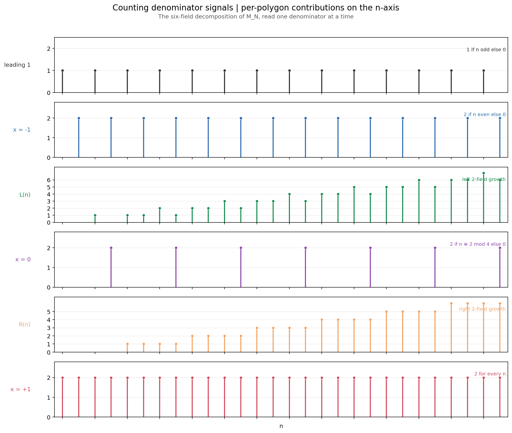

# COUNTING-AND-3DT

What the analogy to the Three Distance Theorem does and does not buy for the outside-out counting word `M_N`.

Primary references:

- `n-gons/counting/COUNTING.md`
- `memos/3DT-BRIEF.md`

## The appeal

The visual comparison is real. In the outside-out annulus, descending from the `n`-ring to the `(n+1)`-ring adds a new rotated layer of points. In the Three Distance Theorem, passing from `n` to `n+1` adds one more point to a growing configuration and changes a finite word of local data. So in both settings there is an evident procedure, and it is natural to ask whether the counting word `M_N` has a 3DT-style compressed evolution law.

## Where the analogy breaks

The 3DT construction is generated by a **fixed rotation**. Its point set is

$$
0,\ \{\alpha\},\ \{2\alpha\},\ \ldots,\ \{(n-1)\alpha\},
$$

so `n -> n+1` means "append the next iterate of one map."

The outside-out counting construction is different. Passing from `N` to `N+1` does **not** append one more iterate of a fixed orbit. It adjoins a whole new rational level: the `(N+1)`-gon contributes its own row of x-coordinates, with its own denominator and its own built-in half-step rotation, and these new coordinates are then merged into the accumulated coincidence pattern.

So the right comparison is not:

- one orbit with one fixed slope,

but:

- a growing union of rational levels, filtered by denominator.

This is why the 3DT theorem cannot simply be imported as-is.

## What survives

Although the construction is not orbit-based, it still has a genuine procedural `N -> N+1` law. The six-field decomposition in `n-gons/counting/COUNTING.md` already gives it:

- the terminal `x = +1` multiplicity always increases by `2`,
- the `x = -1` multiplicity increases by `2` exactly when `N+1` is even,
- the `x = 0` multiplicity increases by `2` exactly when `N+1 ≡ 2 (mod 4)`,
- the initial block of `1`s grows by one exactly when `N+1` is odd,
- the two interior `2`-fields lengthen by the per-polygon contributions `L(N+1)` and `R(N+1)`.

So the counting problem does have a compressed update rule. It is just arithmetic and merge-based rather than dynamical in the 3DT sense.

The outside-out update is denominator-indexed rather than orbit-indexed: each new `n` contributes through six arithmetic signal lanes.

Figure [counting_increment_map.png](../../figures/counting_increment_map.png) visualizes this update law directly. For each transition `N − 1 → N`, cells of `M_N` are colored by whether they are unchanged (gray), grew (orange: same x-column, higher multiplicity), or inserted (green: new x-column). The orange cells recover the closed-form rules above — a continuous staircase at the right edge (terminal always grows), a staircase on the `count at x = −1` column that appears on even `N` only, and isolated interior orange cells on `N ≡ 2 (mod 4)` rows (the `count at x = 0` steps). The green cells are the `≈ N` per-polygon insertions, and the figure makes a specific fact visible: **they are spread diffusely across the whole row, not clustered near the new polygon's contribution positions.** The update is compressed in the sense that a small number of cells change, but the changed cells are scattered, not local. This is the operational reason the 3DT bridge is methodological rather than literal: 3DT's `n → n+1` step edits a local gap-pattern window, while the outside-out step edits a small fraction of cells at positions distributed across the whole word.

## What to look for next

The likely productive bridge is therefore not "force the outside-out annulus into a fixed-rotation theorem." It is:

1. make the update law for `M_N` explicit enough to read as a small-state insertion system,
2. track how the exceptional columns split, shift, and grow when a new rational level is added,
3. and only then ask what trigonometric or lattice constraints are native to that procedure.

In that sense the gap to 3DT is still bridgeable, but the bridge is methodological rather than literal. The lesson from 3DT is not that the two constructions are the same object. The lesson is that a good theorem can emerge once the local procedural relationships are compressed into a visible rule.
