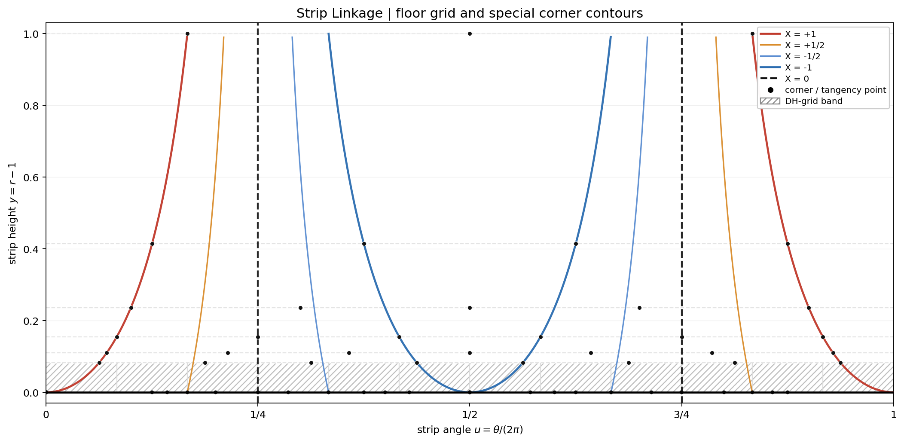
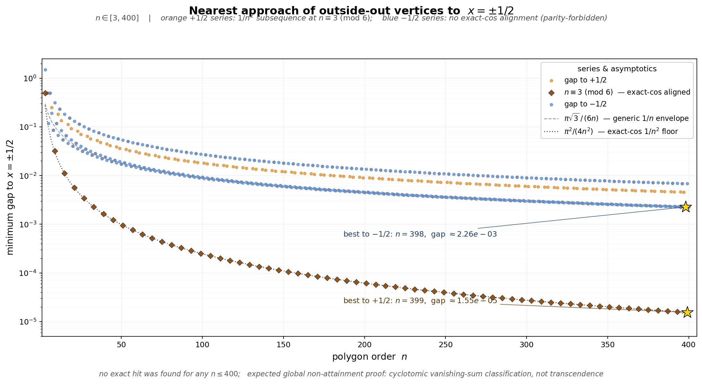

# COUNTING-AND-STRIP

How the outside-out counting word `M_N` sits on the same Archimedean strip as the subpolygon construction, and what the strip picture is good for.

Primary references:

- [COUNTING.md](n-gons/counting/COUNTING.md)
- [n-gons/ARCHIMEDEAN-STRIP-FLIP.md](n-gons/ARCHIMEDEAN-STRIP-FLIP.md)

## One strip, two readouts

On the strip, tangency point `k` of polygon `n` sits on the floor at

$$
\left(\frac{k}{n}, 0\right),
$$

while corner `k` of polygon `n` sits at

$$
\left(\frac{2k+1}{2n}, \sec(\pi/n)-1\right).
$$

The subpolygon construction reads the first set of points. The counting construction reads the second.

- **Subpolygon readout:** put a `DH`-grid on the floor and ask which tangency points lie on gridlines.
- **Counting readout:** keep the corner points and ask which of them share the same sweep x-coordinate.

So the two constructions are not merely adjacent. They are two observables on the same anchored strip.

## The counting observable on the strip

Write strip coordinates as

$$
u=\frac{\theta}{2\pi}, \qquad y=r-1.
$$

Then Euclidean x-coordinate in the original annulus is

$$
X = r\cos\theta = (1+y)\cos(2\pi u).
$$

This is the key formula. A vertical sweep in the annulus is the strip-side question:

> which corner points lie on the same equal-`X` contour of the function
> $X(u,y)=(1+y)\cos(2\pi u)$?

So `M_N` is a corner-incidence word for the level sets of `X`, not a floor-lattice intersection count.

## The bridge figure

[counting_strip_observables.png](figures/counting_strip_observables.png) puts the two readouts on one picture.

- The hatched band at the bottom is the floor zone where the subpolygon observable lives.
- The vertical marks in that band are a sample `DH`-grid.
- The black points on the floor are tangency points.
- The black points above the floor are corner points.
- The planar crystallographic contour family `X \in \{+1,+1/2,0,-1/2,-1\}` is drawn explicitly.

The figure is useful because it makes the asymmetry precise.

- Subpolygon is a **commensurability** problem on the floor.
- Counting is an **incidence** problem at the corners.

Same strip, different readout.

## Why this matters

The strip picture does not prove anything by itself. Its value is organizational.

First, it says where the exceptional counting columns come from geometrically. The large terminal column, the `x=-1` column, and the intermittent `x=0` column are not arbitrary artifacts of a word encoding; they are the rigid equal-`X` contour families visible on the strip. The current six-field picture predicts that these backbone families are the **only** repeated-incidence families: outside them, corner incidences should be generic and unique.

The `X=\pm 1/2` contours are included for the same reason: they belong to the planar Niven/crystallographic value set. In the initial `\psi`-aligned table through `n=30`, they host no exact corner hits, and a wider numerical search through `n=400` also finds none. So at present the visible counting backbone on the strip remains `X \in \{+1,0,-1\}`, with `X=\pm 1/2` acting as a tested but empty comparison family.

The crystallographic comparison guides `X = \pm 1/2` stay empty through `n \le 400`, but `+1/2` is approached much more closely than `-1/2`.

Second, it gives the right kind of bridge to the subpolygon material. The subpolygon theorem is the floor-side theorem of this strip. Counting should therefore be sought as a corner-side theorem on the same apparatus, not as an unrelated combinatorial encoding.

Third, it sharpens what "bring in 3DT" can mean here. The useful lesson from the Three Distance Theorem is not that counting secretly is a fixed-rotation orbit problem. It is that once a procedural observable is compressed into the right strip-side language, real structure may emerge.

## The current theorem target

The strip now suggests a sharper target than "look for hidden collision structure":

> classify all repeated corner incidences of the equal-`X` contours of
> $X(u,y)=(1+y)\cos(2\pi u)$.

Current best guess: the only repeated-incidence families are the backbone values `X ∈ {−2, −1, 0, +1}`, together with the within-polygon symmetry `k ↔ n−1−k` that already accounts for the generic multiplicity `2` in the word. In that formulation, the theorem to prove is a collision-classification statement: if `x_{n_1,k_1} = x_{n_2,k_2}`, then either the two points are the same polygon-symmetry pair, or the common value lies on the backbone.

That is the corner-side analog of the floor-side gcd question, and it is exactly the statement that would make the six-field decomposition complete rather than empirical. The figure should therefore be read as a bridge image plus a theorem target: it tells us where counting lives and which contour families are the only plausible places repeated incidences can survive.

## File

- [n-gons/counting/build_strip_observables.py](n-gons/counting/build_strip_observables.py) — renders the bridge figure to `figures/counting_strip_observables.png`.
