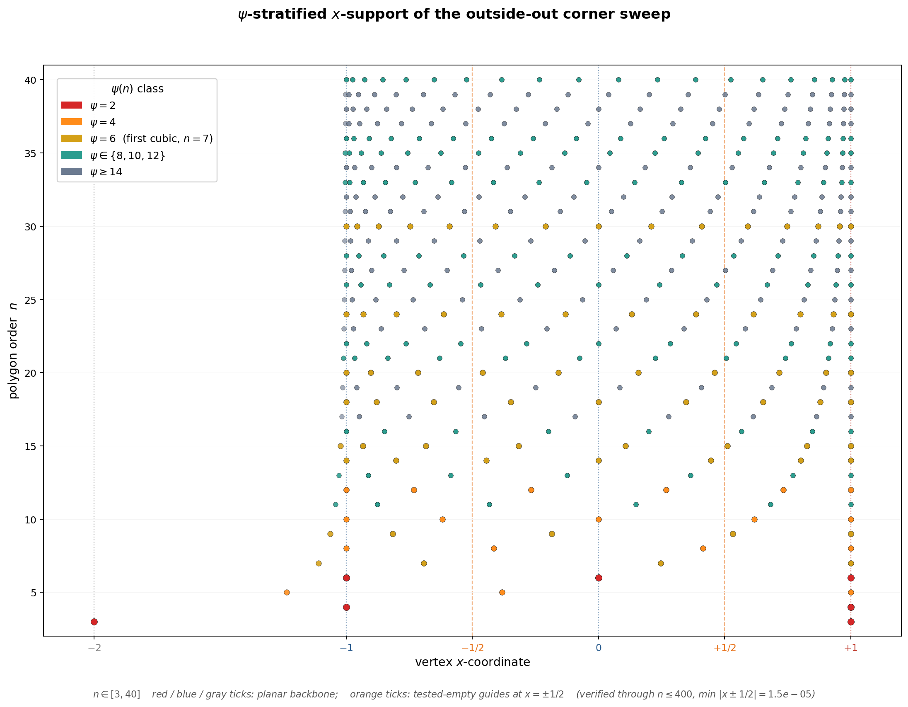

# PSI-STRATIFICATION

The ψ-stratification figure at `figures/counting_psi_stratification.png` (built by `n-gons/counting/build_psi_stratification.py`) is a single-panel scatter of the outside-out corner sweep: one row per polygon order `n ∈ [3, 40]`, one marker per vertex at its x-coordinate `x_{n,k} = sec(π/n)·cos((2k+1)π/n)`, colored by the value of the crystallographic restriction function ψ(n). The backbone guides at `x ∈ {−2, −1, 0, +1}` and the tested-empty guides at `x = ±1/2` are drawn as colored vertical dotted / dashed lines, with the corresponding x-ticks bolded in matching colors so that guide identity is carried by the axis itself. The companion script verifies through `n ≤ 400` that the minimum approach `min |x ± 1/2| = 1.55 × 10⁻⁵` is achieved at `n = 399` — the orange guides are empty not just on `[3, 40]` but through the full verified range.

The choice of ψ as the coloring invariant is deliberate. The outside-out row at fixed `n` lives in the real cyclotomic field `ℚ(cos(2π/n))`, whose native circle-side degree is `φ(n)/2`; that is the CREATI-side closure depth. This figure does **not** color by that degree. It colors by ψ because ψ is the PERMEATE bridge function: ψ is additive on prime-power parts, hence structurally comparable to the log side's additive `v_p` bookkeeping, while `φ(n)/2` is multiplicative in a way the log side does not natively mirror. So the ψ-palette is a cross-domain matching palette, not the corner sweep's own preferred arithmetic-depth scale.

The ψ palette is collapsed into five strata. Crimson at ψ = 2 marks the Bravais orders `n ∈ {3, 4, 6}` — the three polygons whose vertex x-coordinates are entirely rational and hence entirely supported on the backbone. Orange at ψ = 4 picks up `n ∈ {5, 8, 10, 12}`. Gold at ψ = 6 captures `n ∈ {7, 9, 14, 18}`, with `n = 7` flagged in the legend as the first cubic trace-field class: at that row the outside-out field `ℚ(cos(2π/n))` first has degree `φ(n)/2 = 3`, and the half-angle node `cos(π/n)` is simultaneously the first non-constructible one. Teal at ψ ∈ {8, 10, 12} and muted slate at ψ ≥ 14 cover the higher-degree tail; their markers are the smallest and most transparent so the crimson / orange / gold structure on the small-n rows stays legible without the large-n scatter crushing it. Marker size and z-order both drop with ψ-class — the ψ = 2 rows are drawn largest and on top.

The vertical guides carry the planar-backbone structure. Red at `x = +1` — every polygon has two vertices there (anchor tangent point). Blue at `x = −1` — every even polygon has two vertices there (anti-tangent). Blue again at `x = 0` — every `n ≡ 2 (mod 4)` has two vertices there. Gray at `x = −2` — hit only by `n = 3`, a triangle-only hapax. The orange dashed guides at `x = ±1/2` carry the tested-empty diagnostic: these two lines are the only rational x-coordinates within `[−2, +1]` that the sweep *never* lands on (within verification range), which is what makes the Niven-rational-but-empty observation visible at a glance.

Three things the figure makes visible without further prose: (i) the ψ = 2 stratum is exactly the planar backbone — no ψ = 2 marker sits off `x ∈ {−2, −1, 0, +1}`, because the Bravais orders `{3, 4, 6}` are the only polygons with fully rational x-support; (ii) the gold ψ = 6 row at `n = 7` is the first row whose outside-out field has degree `φ(n)/2 = 3`, and the same `n` is the first non-constructible half-angle node — so the row where the ψ-bridge first reaches 6 is also the row where the native trace field first becomes cubic; (iii) the column at `x = ±1/2` stays bare across the full `[3, 40]` plot and the `[3, 400]` verification, a dashed-orange tested-empty stratum that coexists with rational backbone columns on either side — so the rational-x partition visible to the sweep is `{−2, −1, 0, +1}`-carrying vs `{±1/2}`-empty, not a uniform rational lattice. For program context, see `memos/COUNTING-APPARATUS.md §(D)` and `n-gons/counting/COUNTING.md` §"Structural Decomposition".
