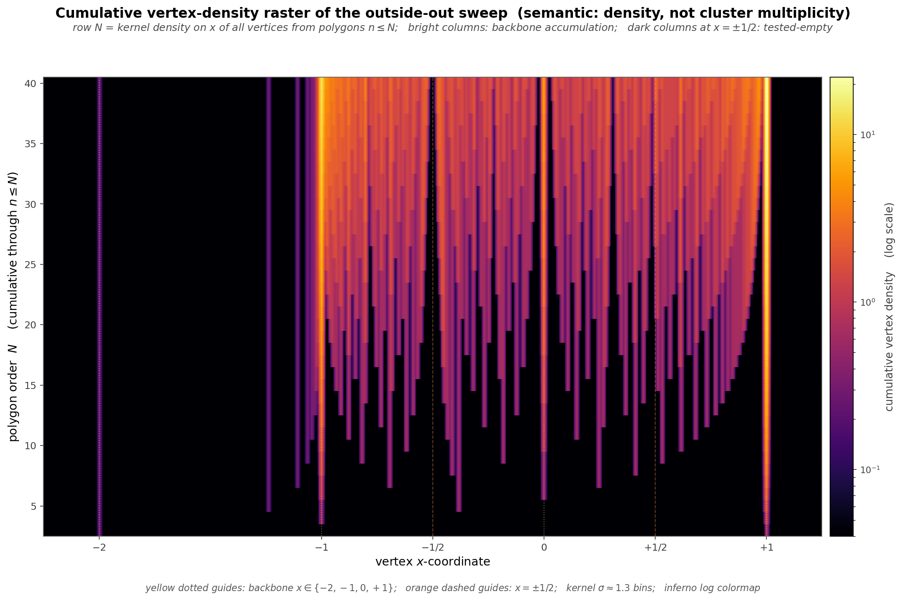

# X-DENSITY-RASTER

The cumulative vertex-density raster at `figures/counting_x_multiplicity_raster.png` (built by `n-gons/counting/build_x_multiplicity_raster.py`) is the x-space companion to PSI-STRATIFICATION and NEAR-HALF-GAPS — a true 2D heatmap of where vertex mass accumulates in the outside-out sweep as polygon order grows. For each row `N ∈ [3, 40]`, the figure plots a kernel density on x of all vertex x-coordinates from polygons `n ≤ N`, cumulative-over-N (matching the definition of `M_N` as the union of all polygon vertices through order N), log color scale via matplotlib's `LogNorm`. Bright yellow bands are backbone accumulation; the darkest vertical stripes sit at `x = ±1/2`, the tested-empty guides. The exact no-hit statement at `±1/2` is now expected to be cyclotomic rather than transcendence-theoretic: `x_{n,k} = ±1/2` rewrites as a four-term ℚ-linear relation among `2n`-th roots of unity, so Conway-Jones-style classification is the natural proof route.

The observable is a deliberate semantic shift from the figure's prior rendering. The older version plotted the M_N multiplicity word as a dot scatter with marker size proportional to count — a dot plot with an area encoding, not actually a raster. The current version plots the cumulative density of the underlying point cloud `{(x_{n,k}, n)} = {(sec(π/n)·cos((2k+1)π/n), n)}`, Gaussian-smoothed in the x direction (kernel `σ ≈ 1.3` bins on a 700-bin x-grid over `[−2.25, 1.25]`) and rendered with `pcolormesh` under an `inferno` colormap. Same raw data, different question: *where does vertex mass sit in x as we sweep up through polygon orders?*

The payload the raster reveals — invisible in the scatter — is the arc structure of the interior. Each curved luminous streak running from upper-left down to `x = +1` at the lower-right is the locus `x_k(N) = sec(π/N)·cos((2k+1)π/N)` for a fixed `k`, swept over `N`. The scatter could not show these curves because each `(n, k)` was a single isolated point with nothing connecting adjacent rows; the density kernel bridges neighboring rows' points into continuous arcs. Each fixed-k curve starts at its low-N end, descends through the interior, and asymptotes to `x = +1` as `N → ∞` (since `sec(π/N) → 1` and `cos((2k+1)π/N) → 1` for fixed k). The raster is the counting directory's portrait of the **continuous manifold on which the integer-polygon vertices sit** — all vertex families visible at once in a single frame, an image-scale counterpart to what `corners/pseudo_chebyshev_continuity.sage` does analytically for a single vertex family.

Three things the raster makes visible without further prose: (i) the backbone columns concentrate the vertex mass with a clear hierarchy — at `N = 40` the column at `x = +1` carries `2·38 = 76` cumulative hits, `x = −1` carries `38` (even-n only), `x = 0` carries `18` (`n ≡ 2 (mod 4)` only), and `x = −2` carries `1` (only `n = 3`); the `76 : 38 : 18 : 1` ratio spans nearly two orders of magnitude and the log colormap resolves all four columns cleanly in one frame; (ii) the arc manifold is the interior's generic behavior — vertex mass there is not random scatter but structured descent along the `x_k(N)` curves, each starting wide and asymptoting inward to `x = +1`; (iii) the tested-empty stripes at `x = ±1/2` are now visually unambiguous — *absence of light* in a figure where the interior is otherwise glowing, which is the clearest form of the Niven-rational-but-empty observation in the repo (and a direct visual complement to the `1.55 × 10⁻⁵` quantitative evidence in `n-gons/counting/NEAR-HALF-GAPS.md`). The visual statement is empirical; the expected exact no-hit theorem is algebraic, via the cyclotomic relation above rather than transcendence input. For program context, see `n-gons/counting/PSI-STRATIFICATION.md`, `n-gons/counting/NEAR-HALF-GAPS.md`, and `n-gons/counting/COUNTING.md` §"Structural Decomposition".
